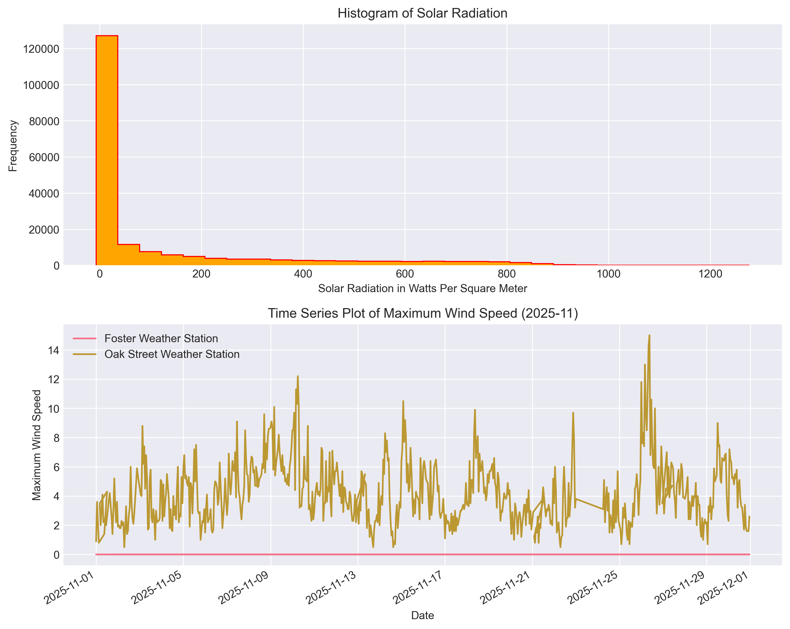
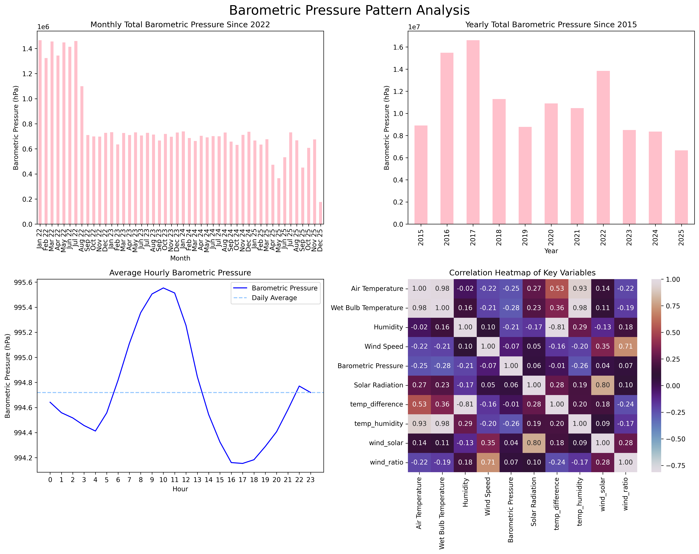
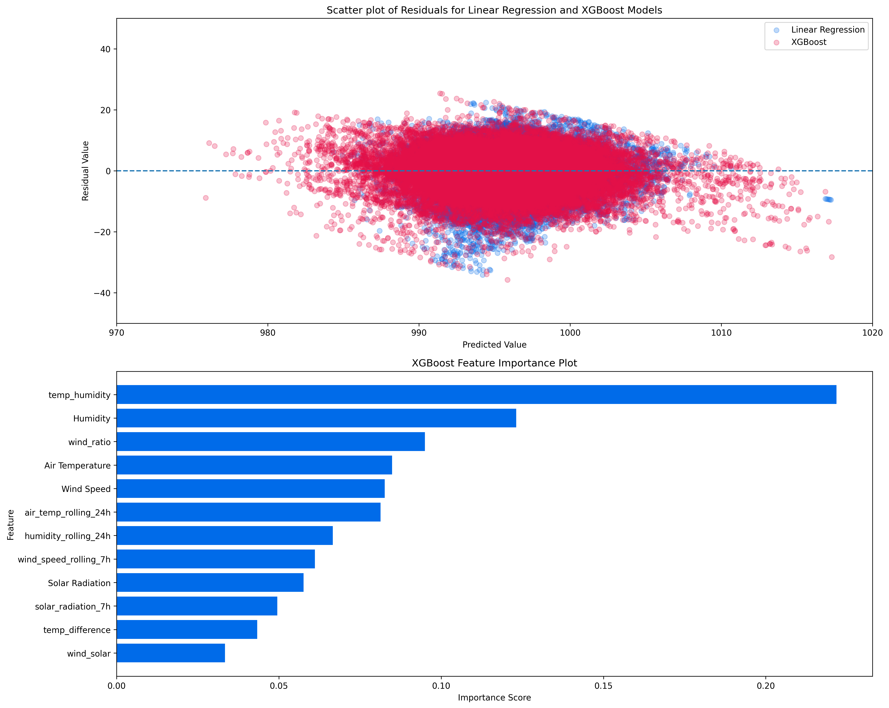

# Chicago Beach Weather Sensors Analysis

## Project Introduction & Rationale

In this project, we utilize data from the City of Chicago's Beach Weather Automated Sensors. The dataset is accessible via the following link: https://data.cityofchicago.org/Parks-Recreation/Beach-Weather-Stations-Automated-Sensors/k7hf-8y75/about_data

The objective for this project is somewhat unorthodox. Instead of trying to predict air temperature or rain intensity, as the features in the dataset clearly align for, we instead set out to see if these features are sufficiently explanatory in characterizing barometric pressure.

Barometric pressure, in simple terms, is a measurement of how "heavy" the air is. Naturally, fluctuations in climate should, theoretically, influence the density in the air. If so, we believe that surface conditions, like air temperature and humidity, should be at least moderately indicative of barometric pressure.

## Phase-by-Phase Findings

### Phase 1: Exploration

Our analysis began by looking at the structure of the dataset. Overall, the dimensions of the dataset are **196,555 x 18**, with 14 features containing numeric data, 2 datetime, and 2 categorical. As of Monday, December 8th, 2025, the dataset contains data from April 25, 2015, to December 8th, 2025, with measurements from three distinct weather stations:

    - 63rd Street Weather Station | n = 49,951 (25.5%)
    - Foster Weather Station | n = 76,069 (38.9%)
    - Oak Street Weather Station | n = 70,535 (36.0%)

**Key Data Quality Issues Identified:**

    - Wet Bulb Temperature, Rain Intensity, Total Rain, Precipitation Type, and Heading are all missing 76,069 (38.7%) values.
    - The missingness in all five of the above features corresponds to the Foster Weather Station.
    - Air Temperature is missing 75 (0.0%).
    - Barometric Pressure is missing 146 (0.1%).
    - All other features, 11/18 (61.1%), contain no missing values.
    - Features containing complete data, however, appear to have implausible values.
    - Examples: Solar Radiation (-100,000), Wind Speed (999.9) 

Initial visualizations showed:
- *Histogram of Solar Radiation:* Histogram was subsetted to include all values ≥ -10,000. As the histogram starts at zero, we see that clearly sentinel value imputation was used here.
- *Time Series Plot of Maximum Wind Speed:* Seasonal patterns visible in maximum wind speed.
- *Time Series Plot of Maximum Wind Speed:* Clear sentinel value imputation present at the Foster Weather Station. More evidence for excluding them from the dataset.

*Figure 1: Initial exploration reveals troubling trends in how the data was coded*

### Phase 2: Data Cleaning

Data cleaning began with the decision to exclude data from the Foster Weather Station. As data from this station was **not missing at random (NMAR)**, and features, like *Wet Bulb Temperature*, were of interest, restricting our analysis to the 63rd Street and Oak Street weather stations was necessary.

Multiple methods were then taken to address missing, placeholder, and unusual values. Methods include clipping features to realistic ranges, recoding features with placeholder values, and primarily using forward-filling for imputation to preserve temporality. *Solar Radiation*, however, was imputed with the value 0, as an analysis of when its values were coded revealed that the unusual values corresponded to the hours of 9:00 PM to 5:00 AM, when solar radiation is expected to be zero.

Below is our cleaning report:

**DATA CLEANING REPORT**

Rows before cleaning: 196555

**Missing Data Handling:**
- Foster Weather Station: 76069 rows (38.7%)
Method: Removed station from dataset
Result: All rows removed from dataset

- Air Temperature: 75 missing values (0.0%)
Method: Forward-fill imputation by station
Result: All missing values filled

- Barometric Pressure: 73 missing values + 6 improperly coded (0.0%)
Method: Improperly coded values converted to NaN. Forward-fill imputation by station
Result: All missing values filled

- Total Rain: Negative values present
Method: Negative values converted to NaN. Forward-fill imputation by station
Result: All missing values filled

- Solar Radiation: Negative values and nighttime missing data
Method: Negative values set to NaN, forward-fill. Remaining missing value (nighttime) set to 0
Result: All missing values filled

- Maximum Wind Speed: Zero values detected
Method: Zero values set to NaN, forward-fill imputation
Result: All missing values filled

**Outlier Handling:**
Method: IQR Method (2xIQR) at Domain Knowledge
- Wind Speed + Maximum Wind Speed: Capped [0, 87]
Result: Negative values and values greater than ever recorded values set to bounds

**Duplicates Removed:** 0

**Data Type Conversions:**
- Measurement Timestamp: Converted to datetime64[ns]
- Measurement Timestamp Label: Converted to datetime64[ns]

**Rows after cleaning:** 120411

Overall, the dataset was quite dirty. Missing values were not universally coded as NaN, requiring us to carefully look at every variable to identify if the values are plausible. We ultimately decided to remove all observations corresponding to the Foster Weather Station, as the station does not appear to track all of the data the other two do, and they appear to apply messy sentinel value imputation that makes cleaning the dataset even more difficult. Ultimately this removal was needed for valid use of all features in later stages of the project, as imputation should not be used for NMAR values.

### Phase 3: Data Wrangling

For time series feature engineering, the `Measurement Timestamp` variable was parsed to extract temporal features. The timestamp follows the format "YYYY-MM-DD HH:MM:SS" using 24-hour military time.

The following temporal features were extracted following the recommended guidelines:

**Temporal Features Extracted:**

    - `hour`: Hour of the day (0-23)
    - `day_of_week`: Day of the week (Monday = 0, Sunday = 6)
    - `month`: Month of the year (January = 1, December = 12)
    - `year`: Year
    - `day_name`: Day name (Monday-Sunday)
    - `is_weekend`: Binary indicator (0: Monday-Friday, 1: Saturday-Sunday)

### Phase 4: Feature Engineering

Following the extraction of our temporal features, six derived and four rolling-window variables were created to explore potential feature relationships and capture temporal variability.

**Abbreviations**

    - T = Temperature
    - H = Humidity
    - WS = Wind Speed
    - MS = Max Wind Speed 
    - SR = Solar Radiation

**Derived Features**

| **Variable**          | **Formula**                          |
|-----------------------|--------------------------------------|
| `temp_difference`     | $T_{air} - T_{wetbulb}$              |
| `temp_humidity`       | $T_{air} \times H$                   |
| `wind_speed_squared`  | $(WS)^2$                             |
| `wind_solar`          | $WS \times SR$                       |
| `wind_ratio`          | $\dfrac{WS}{MS + 1}$                 |
| `temp_category`       | $\text{bin}(T_{air})$                |

**Rolling Window Features**

| **Variable**              | **Formula**                       |
|---------------------------|-----------------------------------|
| `air_temp_rolling_24h`    | $RollingMean_{24} (T_{air})$      | 
| `humidity_rolling_24h`    | $RollingMean_{24}(H)$             |
| `wind_speed_rolling_7h`   | $RollingMean_{7}(WS)$             |
| `solar_radiation_7h`      | $RollingMean_{7}(SR)$             |

**Note:** The derivation of 24 hour rolling variables specific to each station leads to the creation of 46 (0.0%) NaN values. As modeling requires complete data, rows containing these missing values were dropped.

### Phase 5: Pattern Analysis

Pattern analysis revealed several important temporal patterns and correlational worries:

**Temporal Trends:**
- Barometric pressure shows declining trend from 2015-2025
- Unusual spike and subsequent decline from 2021-2023. Grounds for further research
- The last year with complete data, 2024, shows the lowest total yearly pressure (~8M hPa)

**Daily Patterns:**
- Barometric pressure shows expected cyclic trend (peaks 10-12 , craters 16-18)
- Barometric pressure remains roughly consistent throughout the day (range: 994-996 hPa)
- Average hourly barometric pressure is 994.7 hPa

**Correlations:**
- Barometric pressure shows low correlation with all other features (maximum absolute correlation: 0.28)
- Air temperature and Wet bulb temperature nearly perfectly correlated: 0.98
- Wind speed shows low correlation (< |0.22|) with all other non-derived features

*Figure 2: Barometric pressure pattern analysis reveals decreasing trend over time in hPa and low correlation among variables*

### Phase 6: Modeling Preparation

While the results from the correlation analysis were not promising, we proceeded forward with our model preparation.

**Temporal Train/Test Split:**
- Split method: Temporal (70/30 split by time)
- Training set: **84,255 samples** (Date Range: May 2015 to January 2022)
- Test set: **36,110 samples** (Date Range: January 2022 to December 2025)
- Rationale: Time series data requires temporal splitting to avoid data leakage. Note, however, that the decreasing trend in barometric pressure may lead to further model destabilization.

- Number of Features: 12
Target Variable: Barometric Pressure

**Feature Preparation:**
- Number of Features: 12
    - 4 original: Air Temperature, Humidity, Wind Speed, Solar Radiation
    - 4 derived: temp_difference, temp_humidity, wind_ratio, wind_solar
    - 4 rolling-window: air_temp_rolling_24h, humidity_rolling_24h, wind_speed_rolling_7h, solar_radiation_7h
- Target Variable: Barometric Pressure
- **Critical:** No features derived from target variable (see Phase 4 for derivations of every added feature)
- All features adjusted and missing values handled
- Dropped 46 rows with NaN created as a result of rolling-window derivation.
- Final dataset: **120,365 rows** 

### Phase 7: Modeling

Two models were trained and evaluated: Linear Regression and XGBoost.

**Model Performance:**

| Model | R² Score | RMSE | MAE |
|-------|----------|------|-----|
| Linear Regression | 0.1587 | 6.45 hPa | 5.01 hPa |
| XGBoost | 0.2305 | 6.17 hPa | 4.77 hPa |

**Key Findings:**
- Both models showed weak performance (R² < 0.30), indicating that the standard features derived for surface conditions are not sufficient for creating a model to characterize the variation in barometric pressure.
- RMSE (6.17 hPa) and MAE (4.77 hPa) for XGBoost are too large to be reliably used for predictive purposes. Note that daily fluctuations in barometric pressure (see figure 2) average around 2 hPa, so errors that are 2-3 times as much as daily fluctuation are useless.

**Feature Importance (XGBoost):**
Top 3 features (44%) by importance:
1. `temp_humidity` (22.2% importance)
2. `Humidity` (12.3% importance)
3. `wind_ratio` (9.5% importance)

Overall, it seems that humidity plays the biggest role in predicting barometric pressure, with features involving humidity capturing approximately 41.2% of total importance. This makes sense, as humidity leads to higher water concentration in the air, resulting in the air becoming less dense. However, given that the two models performed quite poorly, it leads us to think that humidity might not actually be as indicative of barometric pressure as we once thought.

In addition, feature importance was evenly spread out: 8 of 12 features had importance between 0.05 and 0.10. This further leads us to think that our hypothesis was incorrect and that the features included in our model are not useful for predicting barometric pressure, because it appears that the model is unable to differentiate which features are actually important and related to barometric pressure.

*Figure 3: Final visualizations showing feature importance and a residuals plot comparison between Linear Regression and XGBoost models*

### Phase 8: Results

The results of this analysis show the limitations of predicting barometric pressure using surface-level measurements.

**Summary of Key Findings:**
1. **Model Performance:** XGBoost achieves R² = 0.2305, indicating that 23.05% of variance in barometric pressure can be explained by the features.
2. **Feature Importance:** The derived `temp_humidity` feature is noticeably ahead of most other predictors (22.2% importance). However, feature importance seems pretty evenly spread amongst the remaining predictors.
3. **Temporal Patterns:** Temporal features did not appear to be noticeably more useful compared to other predictors.
4. **Data Quality:** The cleaning process revealed noticeable issues with data recording amongst stations. Further details on individual site codebooks are needed for meaningful analysis of the data.

The residuals plot comparing the residuals in the linear regression versus the XGBoost model showed relatively uniform distribution around zero and no heteroskedasticity. This suggests the model is not biased in its interpretation. 

## Visualizations

*Figure 1: Initial exploration showing distributions and time series of key variables as well as troubling trends in how the station coded the variables.*

*Figure 2: Advanced pattern analysis revealing temporal trends, monthly and yearly developments, daily cycles, and correlations.*

*Figure 3: Final visualizations showing feature importance and a residuals plot comparison between Linear Regression and XGBoost models*

## Model Results

The modeling phase did not successfully build predictive models for barometric pressure. The performance metrics demonstrate that using the surface-level data provided by the City of Chicago's Beach Weather Automated Sensors is not sufficient for creating meaningful predictive models for barometric pressure.

**Performance Interpretation:**
- **R² Score:** Measures proportion of variance explained. XGBoost's R² of 0.2305 means the model explains 23.05% of variance in barometric pressure. This result is quite low and, as a result, uninspiring.
- **RMSE (Root Mean Squared Error):** Average prediction error in original units. XGBoost's RMSE of 6.17 hPa means predictions are typically within 6.17 hPa of actual values. This value is alarming, considering hPa fluctuates by 2 on an hourly basis.
- **MAE (Mean Absolute Error):** Average absolute prediction error. XGBoost's MAE of 4.77 indicates poor predictive accuracy.

**Model Selection:** XGBoost is selected as the best model due to:
1. Highest R² score (0.2305)
2. Lowest RMSE (6.17 hPa)
3. Lowest MAE (4.77 hPa)

**Feature Importance Insights:**
The feature importance analysis reveals that:
- The temp_humidity feature is the most important predictor (22.2% importance)
- 8 of 12 features had importance between 0.05 and 0.10.
- Base Features: 12.3% + 8.5% + 8.3% + 5.8% = 35%
- Derived Features: 22.2% + 9.5% + 4.3% + 3.3% = 39%
- Rolling-window Features: 8.1% + 6.7% + 6.1% + 5.0% = 26%
- No feature domination indicates that neither feature engineering nor temporal aggregation offers unique insights into the variation of barometric pressure.

## Time Series Patterns

The analysis revealed several important temporal patterns:

**Long-term Trends:**
- Decreasing long-term trend of total barometric pressure over a nearly 11-year period.

**Seasonal Patterns:**
- **Monthly:** Barometric pressure remained uniform in 2023 and 2024. In 2025, however, barometric pressure has seen massive fluctuation. This could be due to either incomplete data or funding issues.
- **Daily:** Strong cyclic pattern with barometric pressure, peaking around noon (10-12 PM), and cratering around evening (4-6 PM).

**Temporal Relationships:**
- Air temperature and wet bulb temperature showed the highest absolute correlation with barometric pressure (0.25 and 0.28, respectively)
- Humidity showed a slightly weaker absolute correlation (0.21) despite outperforming other variables in feature importance.

**Anomalies:**
- Foster Weather Station did not record data on several relevant features. 
- Due to consistent lack of data over the 11-year span, this can either be intentional due to location or a general lack of funding to upgrade sensors.

## Limitations & Next Steps

**Limitations:**

1. **Data Quality:**
   - Significant alterations were made to the dataset in attempt to make valid for use in inference. Bias introduced, both statistically through imputation and methodologically through restriction.
   - Outlier capping may have removed some valid extreme events
   - Only 2 weather stations used, limited data and spatial coverage

2. **Model Limitations:**
   - Linear Regression (R² = 0.1587) and XGBoost had poor performance (R² = 0.2305), indicating that neither linear nor non-linear relationships are sufficient given the current data.
   - Model appears unable to differentiate importance between feature types.
   - RMSE of 6.17 hPa and MAE 4.77 hPa are too high for meaningful use in barometric pressure prediction settings.

3. **Feature Engineering:**
   - Some potentially useful features may not have been created (e.g., lag features, interaction terms)
   - Rolling window sizes (7h, 24h) were chosen somewhat arbitrarily
   - External data (e.g., weather forecasts, lake conditions) not incorporated
   - Not all base and derived features were utilized, potentially leaving some information off of the table.

4. **Scope:**
   - Only one target variable analyzed; multi-target modeling could provide additional insights
   - Spatial relationships between stations not analyzed

**Next Steps:**

1. **Model Improvement:**
Model performance was mostly uninspiring. The performance of humidity, however, may suggest that a second model using more of the rain-related features could prove fruitful. However, continuing on in the current direction, we feel, is unlikely to return interesting results.

2. **Feature Engineering:**
Additional features from outside sources is needed to produce meaningful results. The interaction between 'wet' features and spatial features, like distance between stations, could be interesting to explore. Lag values, however, may not be as useful given performance of rolling-window predictors.

3. **Validation:**
Given the overall decreasing nature of barometric pressure, traditional temporal validating methods are unadvisable due to the shifting distribution. Comparison with external sources, like other more professional weather sources, is likely needed in order to actually validate our model's results. There is a need to assess if this direction would be worth the time commitment.

4. **Model's Future:**
Current results suggest any meaningful extension of our work is not coming any time soon. More analysis is needed before potential applications are explored.

## Conclusion

This analysis provided interesting results on the possibility of using surface-level data to characterize barometric pressure. Current model results using the Chicago Beach Weather Sensors data look, unfortunately, disappointing. Our current best model, an XGBoost model, had an overall unremarkable performance (R² = 0.2305, RMSE = 6.17 hPa, MAE = 4.77 hPa). Nevertheless, negative results are still meaningful. From what we see, barometric pressure runs largely independent of surface-level temporal and seasonal data. In addition, we saw firsthand how even data aggregated by multiple sites within the same city can have massively different coding practices, leading to deceptively messy data. Overall, our results show that barometric pressure should be viewed independently of the other data tracked by beach condition monitoring systems.